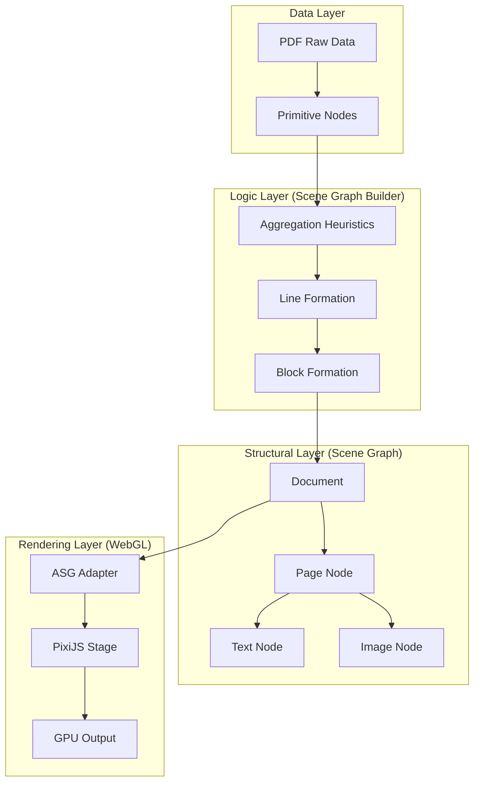

# Architecture Design: DOM-less PDF Editor

This document outlines the architecture for a PDF editor that functions entirely without a traditional DOM. It uses WebGL (PixiJS) for high-performance rendering and a custom Scene Graph for layout management.

## System Overview

The system is divided into four distinct layers: **Data**, **Logic**, **Structural**, and **Rendering**.

## 1. Data Layer (Primitives)
PDF data is inherently unstructured (often "character soup"). 
- **PrimitiveNode**: The smallest unit of data.
  - Characters / Glyphs
  - Path segments (lines, curves)
  - Image bitstreams
- **Metadata**: Every primitive carries its own local transform, font, color, and opacity.

## 2. Logic Layer (Building the Graph)
This layer transforms "character soup" into a logical structure using spatial heuristics.
- **Aggregation**: Groups characters into lines based on Y-proximity and X-inter-spacing.
- **Blocking**: Groups lines into paragraphs (TextBlocks) based on leading (line spacing) and alignment.
- **Normalization**: Ensures that styles (fonts/colors) are inherited or split into spans where necessary.

## 3. Structural Layer (The Scene Graph)
A hierarchical, DOM-less tree that acts as the **Source of Truth**.
- **Document**: The root container for multi-page handling.
- **PageNode**: Represents a physical coordinate space (e.g., A4). Handles its own clipping and resolution.
- **Layout Nodes**:
  - [BlockNode](file:///c:/Users/SUMIT/Downloads/resumemaker-frontend-master/WebGL%20Renderer/webgl/src/engine/WebEngine.jsx#2445-2532): A generic container with styles.
  - [TextNode](file:///c:/Users/SUMIT/Downloads/resumemaker-frontend-master/WebGL%20Renderer/webgl/src/canvasEngine/CanvasEngine.jsx#1028-1132): Contains rich text spans.
  - [ImageNode](file:///c:/Users/SUMIT/Downloads/resumemaker-frontend-master/WebGL%20Renderer/webgl/src/engine/WebEngine.jsx#2533-2625): Manages asynchronous texture loading.

## 4. Rendering Layer (GPU Translation)
The translation of the Scene Graph into GPU commands.
- **ASG Adapter**: Maps the [LayoutNode](file:///c:/Users/SUMIT/Downloads/resumemaker-frontend-master/WebGL%20Renderer/webgl/src/engine/WebEngine.jsx#1899-1977) properties to `PixiJS` DisplayObjects.
- **Stage Management**: 
  - Each `PageNode` can be rendered in its own Pixi stage or as a sub-container of a global stage.
  - **Dynamic Culling**: Only pages visible in the viewport are processed for GPU draw calls.

## 6. Deterministic Text Layout (The "Hard" Part)

You are right—this is usually the most difficult part. However, we have a "cheat code" used by industries like Figma:

### The Measurement Utility (The "Ruler")
We don't need a hidden "stage" that renders everything. Instead, we use a single, lightweight **`OffscreenCanvas`** (or a 2D context) purely as a measurement tool:
- **How it works**: We set the `font` property on the 2D context and call `ctx.measureText()`. 
- **Efficiency**: No pixels are ever drawn. We are only asking the GPU/system to return the mathematical width of a string.
- **Independence**: This utility runs in the background (even in a Web Worker) without interfering with the main WebGL stage.

### The Algorithm (Logic Layer)
We will implement a **Line Breaking Algorithm** (similar to the one in [CanvasEngine.jsx](file:///c:/Users/SUMIT/Downloads/resumemaker-frontend-master/WebGL%20Renderer/webgl/src/canvasEngine/CanvasEngine.jsx)):
1.  **Tokenization**: Split text into words/glyphs.
2.  **Width Accumulation**: Sum character widths until they exceed the `TextBlock` container width.
3.  **Break Decision**: Trigger a line break, handle "orphans" and "widows," and if needed, apply hyphenation logic.

### Why this is Better than DOM:
- **Pixel-Perfect**: DOM rendering can vary slightly between browsers. Our manual math will be **deterministic**—it will look exactly the same on Chrome, Safari, and the final exported PDF.
- **Performance**: We avoid the browser's expensive "Reflow" and "Repaint" cycles.
